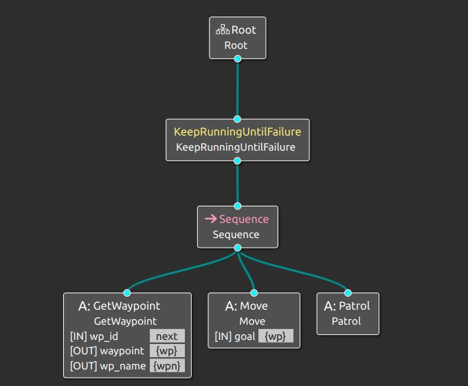

# Patrolling Behavior - NocomPila

## INDEX

* [**PRACTICE DESCRIPTION**](#practice-description)
* [**INSTALLATION**](#installation)
* [**TESTING THE CODE OPERATION**](#testing-the-code-operation)
    * [**START-UP**](#start-up)
* [**PACKAGE TESTS PERFORMED**](#package-tests-performed)
* [**DEVELOPED USING**](#developed-using)
* [**TECHNICL ASPECTS**](#technical-aspects)
* [**CONTRIBUTION**](#contribution)
* [**AUTHORS**](#authors)
* [**ABOUT LICENSE**](#about-license)

---

## Practice description

_The developed application contains the necessary for the Tiago robot to patrol along 5 waypoints in simulation_

---

## Installation

_To obtain this code package and be able to test it, the following steps must be followed:_

_First of all, make sure you also have a clone of the ir_robots and book_ros2 packages. If not, check out the links below and follow the steps to get them:_
* [ir_robots](https://github.com/IntelligentRoboticsLabs/ir_robots)
* [book_ros2](https://github.com/fmrico/book_ros2)

_Create a clone of this GitHub repository in the src directory of the workspace you are going to work with_

```
cd ~/<workspace>/src
git clone <url>
```

_Compile the workspace_

```
cd ..
colcon build
```

_In case you have already compiled recently and only need to do it with this new package:_

```
colcon build --packages-select nc_bt_patrolling
```

---

## Testing the code operation

_Before launching the simulator we must make sure to configure the [tiago_nav_params.yaml](https://github.com/fmrico/book_ros2/blob/main/br2_navigation/params/tiago_nav_params.yaml) file of the br2_navigation package so the Tiago is correctly configured to be using the home map we've previously made. Also, we need to ensure the world used by the ir_robots package, defined in the [params.yaml](https://github.com/IntelligentRoboticsLabs/ir_robots/blob/ros2-humble/config/params.yaml) file. The world must be 'aws_house'_

_Once this is done, to run the code we will follow the steps defined below, on the start-up section_

### Start-up

_First of all we execute in a terminal the command to launch the Gazebo simulation_

```
ros2 launch ir_robots simulation.launch.py
```

_When Gazebo has opened completely, we launch from another terminal the navigation_

```
ros2 launch br2_navigation tiago_navigation.launch.py
```

_Finally, we launch our package with the following command:_

```
ros2 launch nc_bt_patrolling patrolling.launch.py
```

---

## Package tests performed

_To verify that the code passes the roslint and other tests correctly, if modifications have been made, the following commands should be executed from the workspace_

```
colcon build --packages-select nc_bt_patrolling
colcon test --packages-select nc_bt_patrolling
```

_During the practice we have been making sure that all the code periodically passed the tests, if we execute both commands mentioned above immediately after having made the clone of the repository we will see that all the tests pass successfully_

---

## Developed using

_All the software used to carry out this project is mentioned below:_

* [ROS2 Humble](https://docs.ros.org/en/foxy/Releases/Release-Humble-Hawksbill.html) - Middleware for robot programming
* [ir_robots](https://github.com/IntelligentRoboticsLabs/ir_robots) - Used to run the Gazebo simulation
* [book_ros2](https://github.com/fmrico/book_ros2) - Used to navigate properly with the br2_navigation package

---

## Technical aspects

__

_As a curiosity, our package is also parameterized so the waypoints can be easily changed if wanted as well as the names of the different locations through thew file [params.yaml](config/params.yaml)_
_Tiago, by means of the implementing code, checks five points that it receives as parameters one by one. First the gym area, then the bed, the pilates area, the area around the sofa and finally the kitchen. Once it has patrolled all of them, it returns to the first one and repeats the sequence_
_The implementation is dome with continuous integration_

_Here is a schematic image of the behavior tree used for the implementation of the code:_

<p align="center"> 
       
</p>

_In addition, we also have a video of how our package works:_

* [**Tiago simulation video**](https://youtu.be/nlzkDWMOljc)
---

## Contribution

Please read the [CONTRIBUTING.md](CONTRIBUTING.md) for details of our code of conduct, and the collaboration process

---

## Authors

_Practice carried out by URJC students and members of the NocomPila team:_

* **Javier Mayorga Caro** - [javioled](https://github.com/javioled)
* **Marvin Pancracio Manso** - [mpancracio2020](https://github.com/mpancracio2020)
* **Moisés Muñoz Suárez** - [mmunozs2020](https://github.com/mmunozs2020)
* **Víctor Bárcena Mena** - [vbarcena2020](https://github.com/vbarcena2020)

You can also find more information about all our projects in our [GitHub](https://github.com/orgs/Docencia-fmrico/teams/nocompila)

Also you can go to our [youtube channel](https://www.youtube.com/@nocompila) to watch more videos

---

## About license

This project is under license, for more details see the file [LICENSE](LICENSE) 

---
